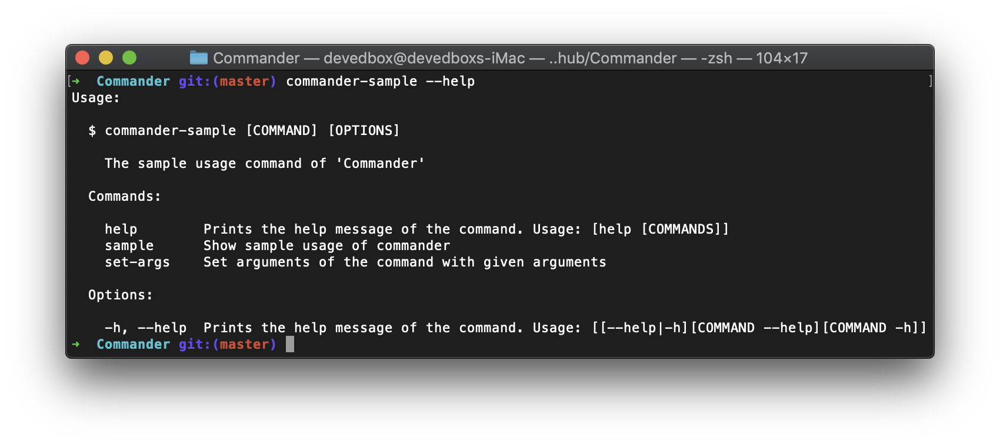

<p align="center">
  
</p>

<p align="center">
  
  <a href="https://codecov.io/gh/devedbox/Commander">
    
  </a>
  <a href="https://codeclimate.com/github/devedbox/Commander/maintainability">
    
  </a>
  
  
  
  <a href="https://gitter.im/commander-swift/Lobby?utm_source=share-link&utm_medium=link&utm_campaign=share-link">
    
  </a>
</p>

<p align="center">
  <a href="https://github.com/devedbox/Commander/watchers">
    
  </a>
  <a href="https://github.com/devedbox/Commander/stargazers">
    
  </a>
  <a href="https://github.com/devedbox/Commander/fork">
    
  </a>
  <a href="https://twitter.com/intent/follow?screen_name=devedbox">
    
  </a>
  <a href="https://twitter.com/intent/tweet?text=Commander+makes+it+easy+to+build+type-safe+and+structured+command-line+interface+program+in+Swift!&url=https%3a%2f%2fgithub.com%2fdevedbox%2fCommander&hashtags=github,swiftlang,commandline,iosdev,commander&original_referer=http%3A%2F%2Fgithub.com%2F&tw_p=tweetbutton">
    
  </a>
</p>

<p align='center'>
  <a href="https://996.icu"></a>
</p>

Commander is a Swift framework for decoding command-line arguments by integrating with Swift standard library protocols Decodable & Decoder. Commander can help you to write **structured cli** program by declaring the structure of `command` and `options` of that command without writing any codes to parse the cli arguments. With Commander, you just need to focus on writing `options` structure of commands, the rest works will be handled by Commander automatically.

<p align="center"></p>

# Table Of Contents

- [Features](#features)
- [Example](#example)
- [Requirements](#requirements)
- [Test Coverage Graph](#test-coverage-graph)
- [Installation](#installation)
  - [Swift Package Manager](#with-spm)
- [Patterns](#patterns)
  - [Key-Value Pairs](#key-value-pairs)
    - [Single Value](#single-value)
    - [Multiple Values](#multiple-values)
  - [Argument](#argument)
- [Value Types](#value-types)
- [Usage](#usage)
  - [Command](#command)
    - [Creating A Command](#creating-a-command)
    - [Dispatching A Command](#dispatching-a-command)
    - [Adding Subcommands](#adding-subcommands)
  - [Options](#options)
    - [Declaring An Options](#declaring-an-options)
    - [Changing Option Symbol](#changing-option-symbol)
    - [Providing A Short Key](#providing-a-short-key)
    - [Providing A Default Value](#providing-a-default-value)
  - [Help Menu](#help-menu)
  - [Arguments](#arguments)
  - [Completions](#completions)
    - [Installing Completion Scripts](#installing-completion-scripts)
      - [Bash](#bash)
      - [Zsh](#zsh)
    - [Write Your Own Completion](#write-your-own-completion)
- [License](#license)

----

<p align="center">
  <a href="https://github.com/devedbox/Commander#features"><b>Features</b></a>
  <body>  -  </body>
  <a href="https://github.com/devedbox/Commander#example"><b>Example</b></a>
</p>

# Features

- [x] Structured-CLI, commands and options are all structured by declaration of `struct` or `class`.
- [x] Options types are type-safe by implementing `Decodable` protocol.
- [x] Automatically generate help message for the `commander` or `command`.
- [x] Shell `<Tab>` completion supported. **Bash/Zsh** `<Tab>` auto-complete scripts supported.
- [x] Swift 4.x compatibility.
- [x] Zero dependency and pure Swift.
- [x] Supports Linux with `swift build`.
  
# Example

With Commander, a command and its associated options could be defined as follows:

```swift
import Commander

public struct SampleCommand: CommandRepresentable {
  public struct Options: OptionsRepresentable {
    public typealias ArgumentsResolver = AnyArgumentsResolver<String>
    public enum CodingKeys: String, CodingKeysRepresentable {
      case verbose = "verbose"
      case stringValue = "string-value"
    }

    public static let keys: [Options.CodingKeys : Character] = [
      .verbose: "v",
      .stringValue: "s"
    ]

    public static let descriptions: [Options.CodingKeys : OptionDescription] = [
      .verbose: .usage("Prints the logs of the command"),
      .stringValue: .usage("Pass a value of String to the command")
    ]

    public var verbose: Bool = false
    public var stringValue: String = ""
  }

  public static let symbol: String = "sample"
  public static let usage: String = "Show sample usage of commander"

  public static func main(_ options: Options) throws {
    print(options)
    print("arguments: \(options.arguments)")
    print("\n\n\(Options.CodingKeys.stringValue.stringValue)")
  }
}
```

Then, configuring the available commands would like this: 

```swift
import Commander

Commander.commands = [
  SampleCommand.self,
  NoArgsCommand.self
]
Commander.usage = "The sample usage command of 'Commander'"
Commander().dispatch() // Call this to dispatch and run the command
```

After which, arguments can be resolved by declaration of `ArgumentsResolver`:

```swift
public typealias ArgumentsResolver = AnyArgumentsResolver<T> // T must be Decodable
```

And you can fetch the arguments by:
```swift
public static func main(_ options: Options) throws {
  print("arguments: \(options.arguments)") // 'arguments' is being declared in OptionsRepresentable 
}
```

At last, run from shell:

```bash
commander-sample sample --verbose --string-value String arg1 arg2
# 
# Options(verbose: true, stringValue: "String")
# arguments: ["arg1", "arg2"]
#
#
# string-value
```

It's easy and fun!!!

----

<p align="center">
  <a href="https://github.com/devedbox/Commander#requirements"><b>Requirements</b></a>
  <body>  -  </body>
  <a href="https://github.com/devedbox/Commander#test-coverage-graph"><b>Test Coverage Graph</b></a>
  <body>  -  </body>
  <a href="https://github.com/devedbox/Commander#installation"><b>Installation</b></a>
</p>

# Requirements

- Mac OS X 10.10+ / Ubuntu 14.10
- Xcode 10
- Swift 4.2

# Test Coverage Graph

<p align="center">
  
</p>

# Installation

## With [SPM](https://github.com/apple/swift-package-manager)

```swift
// swift-tools-version:4.2
dependencies: [
  .package(url: "https://github.com/devedbox/Commander.git", "0.5.6..<100.0.0")
]
```

----

<p align="center">
  <a href="https://github.com/devedbox/Commander#features"><b>Patterns</b></a>
  <body>  -  </body>
  <a href="https://github.com/devedbox/Commander#value-types"><b>Value Types</b></a>
</p>

# Patterns

## Key-Value Pairs

### Single Value

```bash
commander command --key value --key1=value1
commander command --bool
commander command -k value -K=value1
commander command -z=value # {"z": "value"}
commander command -z # {"z": true}
commander command -zop # {"z": true, "o": true, "p": true}
```

### Multiple Values

```bash
commander command --array val1,val2,val3
commander command -a val1,val2,val3
commander command --dict key1=val1,key2=val2,key3=val3
commander command -d key1=val1,key2=val2,key3=val3
commander command --array val1 --array val2 --array val3
commander command -a val1 -a val2 -a val3
commander command --dict key1=val1 --dict key2=val2 --dict key3=val3
commander command -d key1=val1 -d key2=val2 -d key3=val3
```

## Argument

In Commander，The position of arguments is not settled, they can be arywhere but the arguments must be continuous:

```bash
commander command args... --options                   # before options
commander command --options args...                   # after options
commander command --options args... --options         # between options
commander command arg0... --options arg1... --options # Error
```

Use `--` to mark the ends of options and begins of arguments, but, this is normally optional in Commander:

`commander command --options -- args...`

# Value Types

As we all know, all the arguments from `CommandLine.arguments` is `String` type, in Commander, the available value types are:

- Bool: `commander command --verbose`
- Int(8, 16, 32, 64...): `commander command --int 100`
- String: `commander command --string "this is a string value"`
- Array: `commander command --array val1,val2,val3`
- Dictionary: `commander command --dict key1=val1,key2=val2,key3=val3`

Array object is delimited by character `,` and Dict object is delimited by character `=` and `,`.

----

<p align="center">
  <a href="https://github.com/devedbox/Commander#usage"><b>Advanced Usage</b></a>
  <body>  -  </body>
  <a href="https://github.com/devedbox/Commander#license"><b>License</b></a>
</p>

# Usage

Commander supports a main commander alongwith the commands of that commander, and each command has its own subcommands and options.

Using a Commander is simple, you just need to declare the `commands`, `usage` of the commander, and then call `Commander().dispatch()`, the Commander will automatically decode the command line arguments and dispatch the decoded options to the specific command given by command line.

Just as simple as following:

```swift
import Commander

Commander.commands = [
  SampleCommand.self,
  NoArgsCommand.self
]
Commander.usage = "The sample usage command of 'Commander'"
Commander().dispatch()
```
## Command

In Commander, a command is a type(`class` or `struct`) that conforms to protocol `CommandRepresentable`. The protocol *CommandRepresentable* declares the infos of the conforming commands:

- `Options`: The associated type of command's options.
- `symbol`: The symbol of the command used by command line shell.
- `usage`: The usage help message for that command.
- `children`: The subcommands of that command.

### Creating A Command

```swift
public struct Hello: CommandRepresentable {
  public struct Options: OptionsRepresentable {
    public enum CodingKeys: String, CodingKeysRepresentable {
      case verbose
    }
    
    public static let descriptions: [SampleCommand.Options.CodingKeys : OptionDescription] = [
      .verbose: .usage("Prints the logs of the command"),
    ]
    
    public var verbose: Bool = false
  }
  
  public static let symbol: String = "sample"
  public static let usage: String = "Show sample usage of commander"
  
  public static func main(_ options: Options) throws {
    if options.verbose {
      print(options.argiments.first ?? "")
    }
  }
}
```

### Dispatching A Command

Once a command has been created, it can be dispathed against a list of arguments, usually taken from CommandLine.arguments with dropping of the symbol of command itself.

```swift
let arguments = ["sample", "--verbose", "Hello world"]
Command.dispatch(with: arguments.dropFirst())
// Hello world
```

As a real dispatching of command, you don't need to dispatch the command manually, the dispatching will be handled by Commander automatically.

### Adding Subcommands

Adding subcommands in Commander is by declaring the `children` of type `[CommandDescribable.Type]`:

```swift
public struct Hello: CommandRepresentable {
  ...
  public static let children: [CommandDescribable.Type] = [
    Subcommand1.self,
    Subcommand2.self
  ]
  ...
}
```

## Options

The `Options` is the same as command, is a type(`class` or `struct`) that conforms to protocol `OptionsRepresentable` which inherited from `Decodable` and can be treated as a simple data model, will be decoed by the built in code type `OptionsDecoder` in Commander.

### Declaring An Options

As mentioned earlier in *[Creating a Command](#Creating-a-Command)*, declaring an options type is extremely easy, just another data model represents the raw string in command line arguments:

```swift
public struct Options: OptionsRepresentable {
  public enum CodingKeys: String, CodingKeysRepresentable {
    case verbose
  }

  public static let descriptions: [SampleCommand.Options.CodingKeys : OptionDescription] = [
    .verbose: .usage("Prints the logs of the command"),
  ]

  public var verbose: Bool = false
}
```

### Changing Option Symbol

As declared as `public var verbose: Bool`, we can use symbol in command line with `--verbose` accordingly, but how to use another different symbol in command line to wrap `verbose` such as `--is-verbose`? In Commander, we can just do as this:

```swift
public enum CodingKeys: String, CodingKeysRepresentable {
  case verbose = "is-verbose"
}
```

### Providing A Short Key

Sometimes in develping command line tools, using a pattern like `-v` is necessary and helpful. In Commander, providing a short key for option is easy, we just need to declare a key-value pairs of type `[CodingKeys: Character]` in `Options.keys`:

```swift
public struct Options: OptionsRepresentable {
  ...
  public static let keys: [CodingKeys: Character] = [
    .verbose: "v"
  ]
  ...
}
```

### Providing A Default Value

When we difine a flag option in our command, provide a default value for flag is required because if we miss typing the flag in command line, the value of that flag means `false`. Providing default value in Commander is by add declaration in `Options.descritions` as this:

```swift
public struct Options: OptionsRepresentable {
  ...
  public static let descriptions: [SampleCommand.Options.CodingKeys : OptionDescription] = [
    .verbose: .default(value: false, usage:"Prints the logs of the command")
  ]
  ...
}
```

## Help Menu

In Commander, help menu is generated by `CommandDescriber` describing types conforming `CommandDescribable` automatically, including commander itself and all declared commands.

To provide help menu usages, in commands:

```swift
public struct Hello: CommandRepresentable {
  ...
  public static let symbol: String = "sample"
  public static let usage: String = "Show sample usage of commander"
  ...
}
```

In options:

```swift
public struct Options: OptionsRepresentable {
  ...
  public static let descriptions: [SampleCommand.Options.CodingKeys : OptionDescription] = [
    .verbose: .default(value: false, usage:"Prints the logs of the command")
  ]
  ...
}
```

Normally, the help usage message and default can both be provided by type `OptionsDescriotion`.

After declaration of usages, run `help` in terminal:

```bash
commander-sample --help # or, commander-sample help
# Usage:
#
#   $ commander-sample [COMMAND] [OPTIONS]
#
#     The sample usage command of 'Commander'
#
#   Commands:
#
#     help        Prints the help message of the command. Usage: [help [COMMANDS]]
#     sample      Show sample usage of commander
#     set-args    Set arguments of the command with given arguments
#
#   Options:
#
#     -h, --help  Prints the help message of the command. Usage: [[--help|-h][COMMAND --help][COMMAND -h]]
```

For specific commands, run as this:

```bash
commander-sample help sample # or, commander-sample sample --help
# Usage of 'sample':
#
#   $ commander-sample sample [SUBCOMMAND] [OPTIONS] [ARGUMENTS]
#
#     Show sample usage of commander
#
#   Subcommands:
#
#     set-args            Set arguments of the command with given arguments
#
#   Options:
#
#     -s, --string-value  Pass a value of String to the command
#     -h, --help          Prints the help message of the command. Usage: [[--help|-h][COMMAND --help][COMMAND -h]]
#     -v, --verbose       Prints the logs of the command
#
#   Arguments:
#
#     [String]            commander-sample sample [options] arg1 arg2 ...
```

## Arguments

In Commander, an option can take multiple arguments from command line arguments as the arguments of that option, and can be accessed by calling `options.arguments`. The arguments decoding can not be resolvable by default, if you want to resolve the decoding of arguments, you must declare the `ArgumentsResolver` of the options:

```swift
public struct Options: OptionsRepresentable {
  ...
  public typealias ArgumentsResolver = AnyArgumentsResolver<String>
  ...
}
```

The type `AnyArgumentsResolver<T>` is generic type where the type `T` representing the type of arguments' element. With the declaration above, we can do this is command line:

```bash
commander hello --verbose -- "Hello world" "Will be dropped"
# "Hello world" "Will be dropped" are both the arguments of Hello.Options
```

## Completions

Commander provided the api to write auto-completion in bash/zsh, the requirement is declared in protocol `ShellCompletable`. The `CommandDescribable` and `OptionsDescribable` is inherited from `ShellCompletable` by default.

To implemente auto-completion, you just need to write:
```swift
import Commander.Utility
// Options:
public static func completions(for commandLine: Utility.CommandLine) -> [String] {
  switch key {
  case "--string-value":
    return [
      "a", "b", "c"
    ]
  default:
    return [ ]
  }
}
```

In terminal, type this:

```bash
commander sample --string-value <Tab>
# a	b	c
```

### Installing Completion Scripts

Commander can generate auto-completion scripts for you, you can run the built-in command `complete generate` to generate the scripts according to the shell type. Currently available shells are:

- bash
- zsh

#### Bash

- run in terminal：`commander complete generate --shell=bash > ./bash_completion`
- then：`source ./bash_completion`
- or, install the scripts to the login scripts of bash for good at `~/.profile`

#### Zsh

- run in terminal：`commander complete generate --shell=zsh > ~/zsh_completions/_commander`
- add contents to `~/.zshrc`:
  ```zsh 
  fpath=(~/zsh_completions $fpath)
  autoload -U +X compinit && compinit
  autoload -U +X bashcompinit && bashcompinit
  ```
- restart you terminal

### Write Your Own Completion

`CommandDescribable` already provided the default implementation of completion, by default, CommandDescribable provides the subcommands alongwith options as the completions for shell, you can override the default implementation to provide your custom completions to Commander.

`OptionsDescribable` returns an empty completions by default, OptionsDescribable will be called during the calling of CommandDescribable automatically, You must override the implementation of OptionsDescribable to provide your completions or an empty completions will be used.

This is an example to provide `git branchs` completions to shell:

```swift
import Commander.Utility

public static func completions(for commandLine: Utility.CommandLine) -> [String] {
  let current = commandLine.arguments.last
  let previous = commandLine.arguments.dropLast().last

  switch current {
  default:
    let outputs = ShellIn("git branch -r").execute().output.flatMap {
      String(data: $0, encoding: .utf8)
    } ?? ""

    return outputs.split(whereSeparator: {
      " *->\n".contains($0)
    }).map {
      if $0.hasPrefix("origin/") {
        return String(String($0)["origin/".endIndex...])
      } else {
        return String($0)
      }
    }
  }
}
```

# License

Commander is released under the [MIT license](LICENSE).
